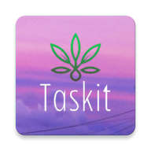

# Taskit

Taskit is an Android application designed to incentivize users to engage in environmentally friendly activities in their daily lives. Users earn points by completing tasks related to sustainability and eco-conscious behavior. These points can be redeemed for rewards within their institution.

## Features

- **Task Rewards**: Earn points by completing environmentally friendly tasks.
- **Random Task Generation**: New tasks are generated by AI each time you use the app, ensuring variety and engagement.
- **Task Completion**: Once a task is completed, it will not appear again, but users will receive new tasks regularly.
- **Reward Redemption**: Accumulated points can be redeemed for rewards within the user's institution.
- **Environmentally Conscious**: All tasks are designed to promote eco-friendly behavior and sustainability.

## Installation

To get started with Taskit, follow these steps:

1. Download the latest release APK from the [Releases](https://github.com/lakshrajj/Taskit/releases) page.
2. Install the APK on your Android device.
3. Open Taskit and sign up for an account.
4. Start completing tasks and earning points!

## Usage

Taskit is simple to use:

1. **Sign Up**: Create an account or sign in if you already have one.
2. **View Tasks**: Browse through the list of available tasks, each promoting environmentally friendly actions.
3. **Complete Tasks**: Select a task, follow the instructions, and complete it in your daily life.
4. **Earn Points**: Receive points upon completing each task.
5. **Redeem Rewards**: Accumulate points over time and redeem them for rewards within your institution.

## Contributing

Contributions to Taskit are welcome! If you have ideas for new features, improvements, or bug fixes, please feel free to open an issue or submit a pull request.

## License

This project is licensed under the MIT License - see the [LICENSE](LICENSE) file for details.

## Contact

For any inquiries or support, you can reach out to the project maintainer at [HERE](mailto:lakshrajme@gmail.com).
